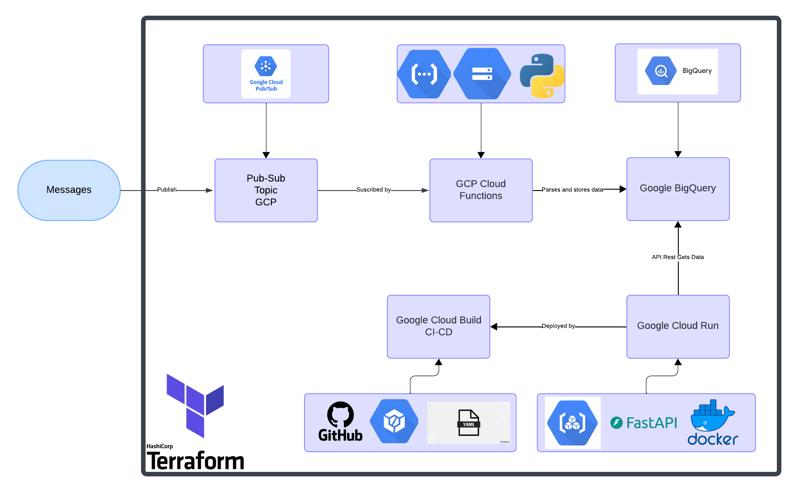

# Cloud Data Ingestion and Exposure System

## Overview

This project implements a cloud-based system for ingesting, storing, and exposing data using Infrastructure as Code (IaC) and CI/CD pipelines. The system is designed to ensure data is efficiently processed and made available through an HTTP API.

## Objectives

- **Data Ingestion**: Utilize a Pub/Sub pattern for data ingestion.
- **Data Storage**: Store data in a database optimized for analytics.
- **Data Exposure**: Provide an HTTP endpoint to serve stored data.
- **Infrastructure Deployment**: Deploy infrastructure using Terraform.
- **CI/CD**: Implement CI/CD pipelines for automated deployment.

## Architecture

The system architecture consists of the following components:

1. **Pub/Sub Topic**: Receives messages and triggers data processing.
2. **Cloud Function**: Processes incoming messages and stores data in BigQuery.
3. **BigQuery**: Serves as the data warehouse for analytics.
4. **FastAPI Application**: Provides an HTTP API to retrieve data from BigQuery.
5. **Cloud Run**: Hosts the FastAPI application in a serverless environment.

### Data Flow

1. **Message Ingestion**: Messages are published to a Pub/Sub topic.
2. **Data Processing**: A Cloud Function is triggered to parse and store data in BigQuery.
3. **Data Exposure**: A FastAPI application retrieves and serves data via an HTTP GET request.

## Technologies Used

- **Terraform**: For infrastructure provisioning.
- **Python**: For application logic in Cloud Functions and FastAPI.
- **Docker**: For containerizing the FastAPI application.
- **CI/CD**: Implemented using Cloud Build and YAML configurations.

## Infrastructure Details

### Terraform Resources

- **Pub/Sub Topic**: `google_pubsub_topic` (lines 6-8)
- **Storage Bucket**: `google_storage_bucket` (lines 10-13)
- **BigQuery Dataset**: `google_bigquery_dataset` (lines 15-18)
- **BigQuery Table**: `google_bigquery_table` (lines 20-24)
- **Cloud Function**: `google_cloudfunctions_function` (lines 26-42)
- **Artifact Registry**: `google_artifact_registry_repository` (lines 44-50)
- **Cloud Run Service**: `google_cloud_run_service` (lines 52-65)

## CI/CD Pipeline

The CI/CD pipeline is defined in `cloudbuild.yaml` and includes the following steps:

1. **Build**: Docker image is built for the FastAPI application.
2. **Push**: The Docker image is pushed to the Artifact Registry.
3. **Deploy**: The FastAPI application is deployed to Cloud Run.

## Usage

1. **Deploy Infrastructure**: Use Terraform to deploy the necessary infrastructure.
2. **Publish Messages**: Send messages to the Pub/Sub topic to trigger data ingestion.
3. **Access API**: Use the FastAPI endpoint to retrieve data from BigQuery.

## Diagram

## Conclusion

This project demonstrates a complete end-to-end solution for data ingestion, storage, and exposure using cloud-native technologies and best practices in IaC and CI/CD.

## Proposed Integration Tests

1. **Data Ingestion Test**: Validate that messages published to the Pub/Sub topic are correctly processed and stored in BigQuery.
2. **API Query Parameter Test**: Ensure the API correctly handles various query parameters and returns expected results.
3. **Load Test**: Simulate multiple concurrent requests to the API to assess system performance under load.

## Critical Points and Testing Proposals

1. **Pub/Sub Message Processing Latency**: Measure the time from message publication to data storage in BigQuery.
2. **API Response Time**: Monitor and log response times to identify performance bottlenecks.
3. **BigQuery Query Performance**: Analyze and optimize query execution times.

## System Robustness Improvements

1. **Retries and Backoff**: Implement retries with exponential backoff for Pub/Sub message processing to handle transient errors.
2. **Caching**: Use caching mechanisms to reduce load on BigQuery for frequently accessed data.
3. **Monitoring and Alerting**: Implement monitoring and alerting for critical metrics such as API response time and error rates.

## Monitoring and Metrics

### Proposed Metrics

1. **Pub/Sub Message Processing Latency**: Measure the time taken from message publication to data storage in BigQuery.
2. **API Response Time**: Track the time taken for the FastAPI application to respond to requests.
3. **BigQuery Query Execution Time**: Monitor the time taken to execute queries in BigQuery.

### Visualization Tool

**Tool**: Google Cloud Monitoring

- **Metrics to Display**:
  - Pub/Sub Message Processing Latency
  - API Response Time
  - BigQuery Query Execution Time

- **Strategic Insights**: Visualizing these metrics helps identify performance bottlenecks and optimize system performance.

### Implementation Overview

1. **Setup Google Cloud Monitoring**: Enable and configure it in your GCP project.
2. **Create Dashboards**: Display the proposed metrics.
3. **Alerting**: Set up alerts for critical thresholds.

### Scaling Considerations

- **Visualization Changes**: Use grouping and filtering for multiple systems.
- **Additional Metrics**: Consider inter-system communication latency and error rates.
- **Visualization Techniques**: Use heatmaps or aggregate views.

### Challenges and Limitations

- **Data Overload**: Implement effective filtering and aggregation.
- **Alert Fatigue**: Ensure alerts are meaningful.
- **Scalability of Monitoring Infrastructure**: Ensure it can handle increased load.

## Alerting and SRE

### Alert Rules and Thresholds

1. **Pub/Sub Message Processing Latency**:
   - **Threshold**: Alert if the average latency exceeds 5 seconds over a 5-minute window.
   - **Rationale**: High latency in message processing can indicate bottlenecks in the data ingestion pipeline, potentially leading to delays in data availability.

2. **API Response Time**:
   - **Threshold**: Alert if the 95th percentile of response times exceeds 500 milliseconds over a 10-minute window.
   - **Rationale**: Ensuring low response times is critical for user experience. Monitoring the 95th percentile helps catch outliers that could affect users.

3. **BigQuery Query Execution Time**:
   - **Threshold**: Alert if the average query execution time exceeds 2 seconds over a 10-minute window.
   - **Rationale**: Slow query execution can impact data retrieval performance, affecting downstream applications and analytics.

### SLIs and SLOs

1. **SLI for Pub/Sub Message Processing Latency**:
   - **SLI**: Percentage of messages processed within 5 seconds.
   - **SLO**: 99% of messages should be processed within 5 seconds.
   - **Rationale**: This SLI focuses on the efficiency of the data ingestion pipeline. A high SLO ensures timely data processing, which is crucial for real-time analytics.

2. **SLI for API Response Time**:
   - **SLI**: Percentage of API requests with response times under 500 milliseconds.
   - **SLO**: 95% of API requests should have response times under 500 milliseconds.
   - **Rationale**: This SLI ensures a responsive user experience. The SLO is set to 95% to account for occasional spikes due to network or server load.

3. **SLI for BigQuery Query Execution Time**:
   - **SLI**: Percentage of queries executed within 2 seconds.
   - **SLO**: 98% of queries should be executed within 2 seconds.
   - **Rationale**: This SLI ensures efficient data retrieval. A high SLO is necessary to maintain performance for analytics and reporting.

### Why These SLIs/SLOs?

- **Focus on User Experience**: The chosen SLIs directly impact user experience and system performance, which are critical for maintaining service quality.
- **Actionable Metrics**: These SLIs are actionable, meaning they can be directly influenced by system improvements and optimizations.
- **Exclusion of Other Metrics**: Metrics like CPU/RAM/DISK usage are excluded from SLIs because they are more indicative of resource utilization rather than direct service performance. They are still important for monitoring but are not primary indicators of service quality.

### Implementation with Google Cloud Monitoring

- **Alerting**: Use Google Cloud Monitoring to set up alerting policies based on the defined thresholds. Configure notifications to be sent to the appropriate team members via email, SMS, or integration with incident management tools like PagerDuty.
- **SLI/SLO Monitoring**: Use Google Cloud Monitoring's SLO feature to define and track SLIs and SLOs. This allows for continuous monitoring and reporting on service performance against the defined objectives.

